# Meridian

Meridian is a mobile-first personal financial command center over Crew. It brings current cash, planned obligations, activity, accounts, evidence, and a carefully bounded assistant into one calm Observatory interface.

The repository was previously named SimpleCrew/ORSC. The product direction is now Meridian; the GitHub repository is being renamed to match.

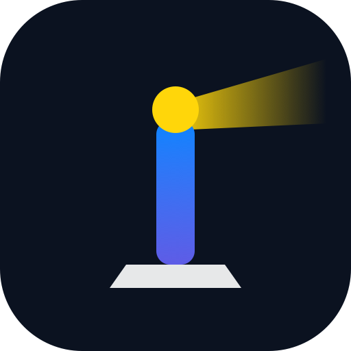

## Product overview

Meridian is built around four financial workspaces and a Settings utility:

- **Today** explains current Safe to Spend, upcoming money moments, forecast freshness, runway, commitments, and Virgil's evidence-linked brief.
- **Plan** models named funding schedules, pay events, bills, goals, reserves, contribution limits, shortfalls, and dated forecasts without double-counting reserved money.
- **Activity** separates Timeline (what happened), Review (what needs a bookkeeping decision), and Patterns (observed trends with evidence). Categories are deterministic when the merchant identity is clear, while mixed or uncertain transactions remain reviewable.
- **Accounts** shows cash, pockets, liabilities, provenance, freshness, net position, and connection health.
- **Settings** is the utility surface for connections, preferences, approval boundaries, memory and privacy, notifications, security, backups, and action history.
- **Virgil** is the consistent evidence-led assistant identity. It can explain, investigate, plan, and draft proposals; voice, iPhone actions, and consequential financial work remain capability-gated and owner-approved.

## Current functionality

The current codebase includes Flask/Jinja and vanilla JavaScript surfaces, a responsive PWA shell, Crew-oriented read models, synthetic Observatory previews, local schedule and bill persistence, funding previews, proposal and approval boundaries, transaction classification and correction history, account/activity reads, connection metadata, read-only evidence connectors, and passkey/session foundations.

Deterministic classification currently covers 29 categories and 51 curated merchant rules with conservative identity matching. Owner corrections survive provider refreshes. Explicitly unclassified transactions stay in Review and cannot be approved as “Uncategorized.” Category and action icons are semantic SVG assets rather than one reused clock or compass glyph.

Financial authority follows this state machine:

```text
observe → explain/simulate → propose → owner approval → execute once → provider readback
```

No design asset or model response bypasses that boundary.

## Planned functionality

The roadmap continues toward:

- trustworthy 7-, 30-, 90-, and 365-day projections with explicit evidence, age, assumptions, and uncertainty;
- continuously repaired budgets, paycheck landing, scenario simulation, counterfactual learning, and proactive financial weather;
- balance forensics, anomaly investigation, refunds and subscription lifecycle support, reimbursement tracking, and connected biller monitoring;
- multiple independent email and calendar identities with scoped read-only permissions, cursors, revocation, and retention;
- Virgil's staged iPhone path: contracts and threat model, read-only voice, typed device actions, proposal bridge, proactive tasks, then richer native surfaces;
- household/resource planning and bounded autonomous tools only where the owner-approved permission set, lifetime, evidence, and approval boundary are explicit.

Planned means designed or routed in the roadmap. It does not mean deployed or provider-accepted.

## Concept gallery

These are visual concepts and handoff references. They are not screenshots of shipped production behavior. The first seven are the current Observatory composition set; the four dated September 18 concepts extend Activity, Settings, and Virgil.

### Current Observatory concepts

| Surface | Concept |
|---|---|
| Selected direction | 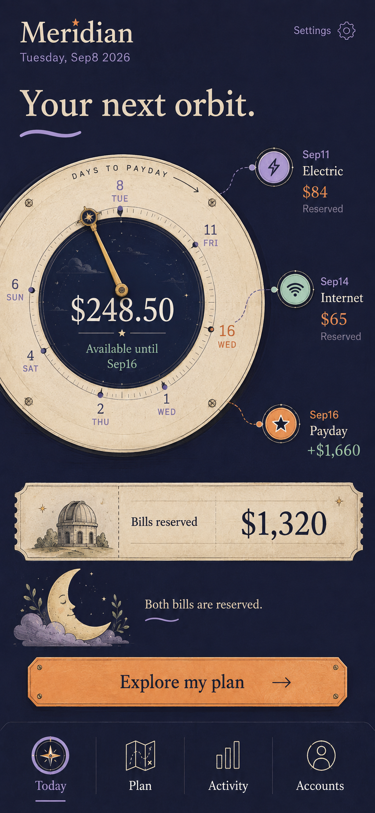 |
| Today | 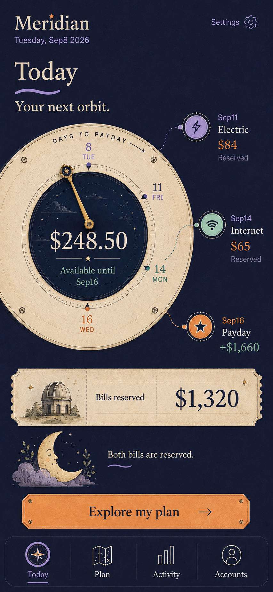 |
| Plan | 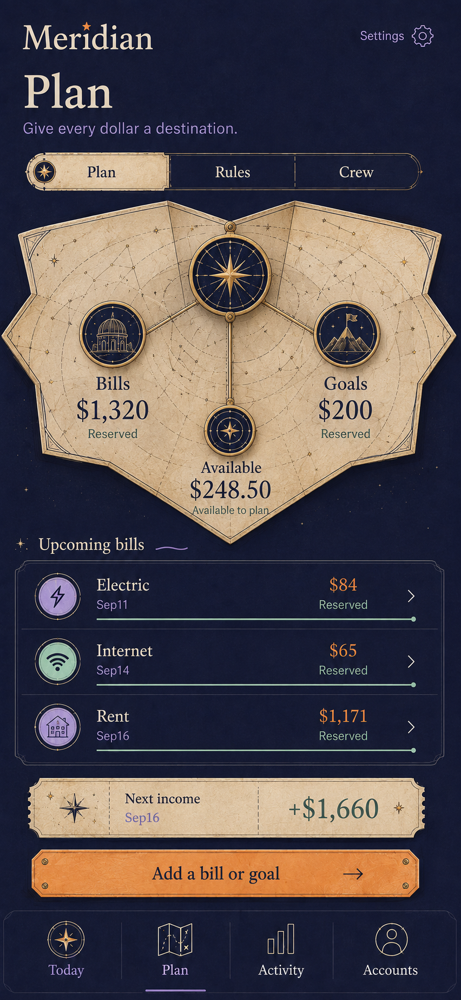 |
| Activity | 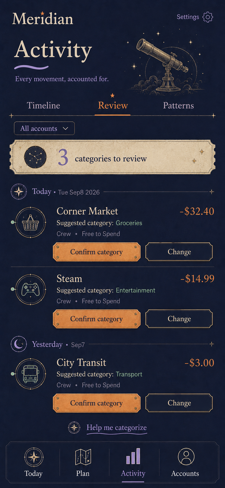 |
| Accounts | 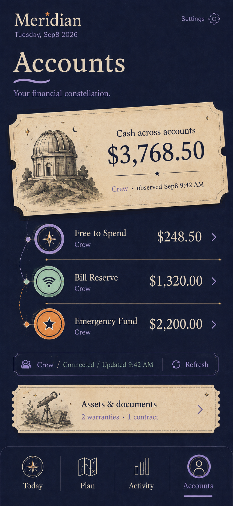 |
| Settings | 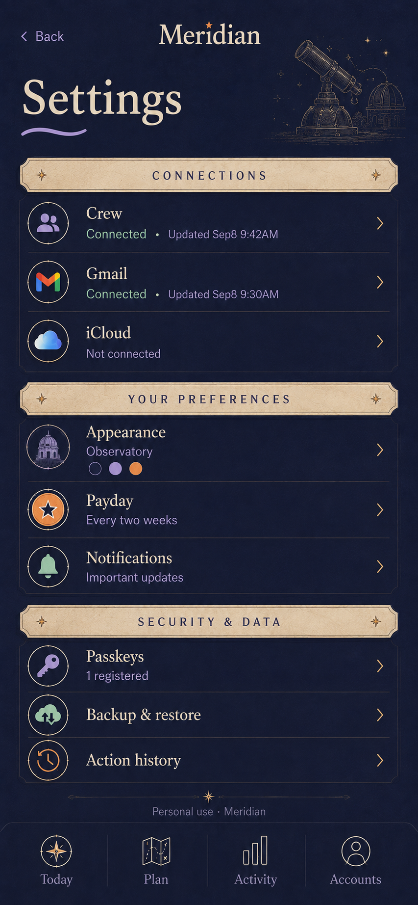 |
| Interactive observatory | 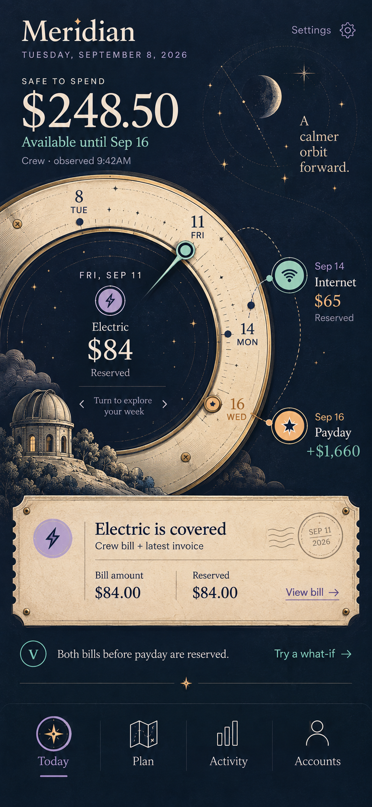 |

### September 18 extension concepts

| Surface | Concept |
|---|---|
| Timeline | 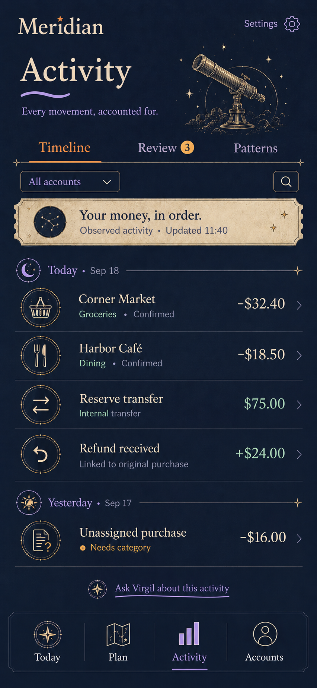 |
| Review | 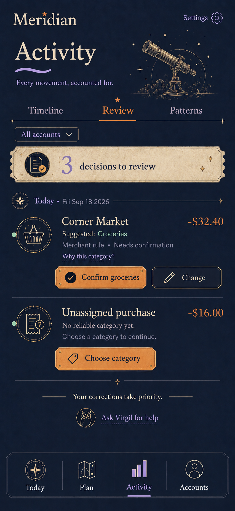 |
| Settings refresh |  |
| Virgil refresh | 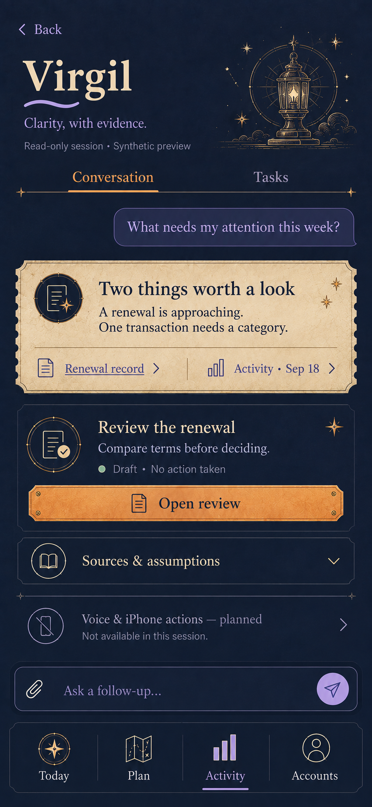 |

The complete implementation handoff, icon map, prompt set, deep-orange token proposal, and licensed SVG specimen are in [`design/observatory-extension-2026-09-18/`](design/observatory-extension-2026-09-18/).

## Development

This repository is an active implementation lane. Read [`AGENTS.md`](AGENTS.md), [`docs/project/PROJECT_INSTRUCTIONS.md`](docs/project/PROJECT_INSTRUCTIONS.md), [`docs/project/MERIDIAN_DECISIONS.md`](docs/project/MERIDIAN_DECISIONS.md), and [`docs/project/CURRENT_STATUS.md`](docs/project/CURRENT_STATUS.md) before changing code.

Use the pinned Python 3.11 environment for verification:

```bash
.venv311/bin/python -m pytest -q
.venv311/bin/python -m ruff check .
```

The isolated Observatory preview uses synthetic data only:

```bash
.venv311/bin/python scripts/preview_observatory_dial.py
```

Never put Crew tokens, cookies, OTPs, raw financial payloads, or provider credentials in fixtures, prompts, screenshots, logs, or commits. No live financial mutation is required to inspect the concepts or run the deterministic classifier tests.

## Status

The concept and deterministic-classification handoff is complete. DeepSeek owns the subsequent production integration and governed visual acceptance. Deployment, live provider acceptance, and owner-observed mobile acceptance remain separate gates.

## License

MIT. See [`LICENSE`](LICENSE).
